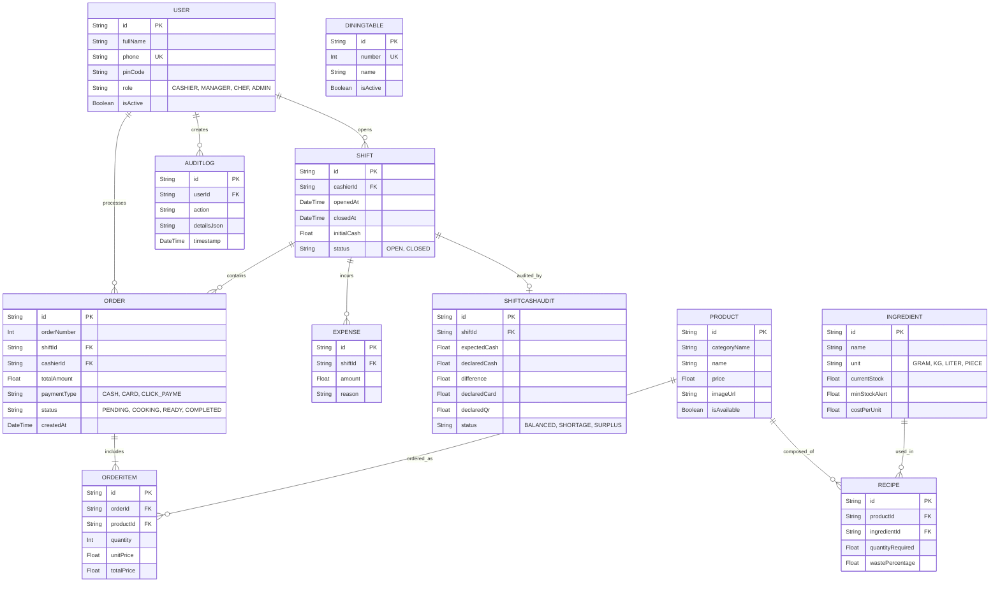

# FastFoodCash Database Schema (ERD)

This document visualizes the entity-relationship diagram for the FastFoodCash POS system. It is generated based on the Prisma schema.

```mermaid
erDiagram
    USER ||--o{ SHIFT : opens
    USER ||--o{ ORDER : processes
    USER ||--o{ AUDITLOG : creates
    SHIFT ||--o{ ORDER : contains
    SHIFT ||--o{ EXPENSE : incurs
    SHIFT ||--o| SHIFTCASHAUDIT : audited_by
    ORDER ||--|{ ORDERITEM : includes
    PRODUCT ||--o{ ORDERITEM : ordered_as
    PRODUCT ||--o{ RECIPE : composed_of
    INGREDIENT ||--o{ RECIPE : used_in

    USER {
        String id PK
        String fullName
        String phone UK
        String pinCode
        String role "CASHIER, MANAGER, CHEF, ADMIN"
        Boolean isActive
    }

    PRODUCT {
        String id PK
        String categoryName
        String name
        Float price
        String imageUrl
        Boolean isAvailable
    }

    INGREDIENT {
        String id PK
        String name
        String unit "GRAM, KG, LITER, PIECE"
        Float currentStock
        Float minStockAlert
        Float costPerUnit
    }

    RECIPE {
        String id PK
        String productId FK
        String ingredientId FK
        Float quantityRequired
        Float wastePercentage
    }

    ORDER {
        String id PK
        Int orderNumber
        String shiftId FK
        String cashierId FK
        Float totalAmount
        String paymentType "CASH, CARD, CLICK_PAYME"
        String status "PENDING, COOKING, READY, COMPLETED"
        DateTime createdAt
    }

    ORDERITEM {
        String id PK
        String orderId FK
        String productId FK
        Int quantity
        Float unitPrice
        Float totalPrice
    }

    SHIFT {
        String id PK
        String cashierId FK
        DateTime openedAt
        DateTime closedAt
        Float initialCash
        String status "OPEN, CLOSED"
    }

    SHIFTCASHAUDIT {
        String id PK
        String shiftId FK
        Float expectedCash
        Float declaredCash
        Float difference
        Float declaredCard
        Float declaredQr
        String status "BALANCED, SHORTAGE, SURPLUS"
    }

    EXPENSE {
        String id PK
        String shiftId FK
        Float amount
        String reason
    }

    AUDITLOG {
        String id PK
        String userId FK
        String action
        String detailsJson
        DateTime timestamp
    }

    DININGTABLE {
        String id PK
        Int number UK
        String name
        Boolean isActive
    }
```
